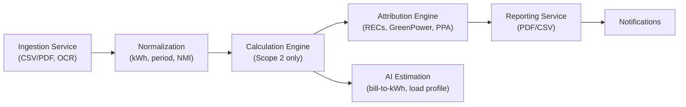

# 🌏 CarbonIQ

> **AI-powered Scope 2 carbon accounting & reporting**  
> Transparent, audit-ready, and aligned with **Climate Active** & **ASRS** standards.

## 💡 Tagline
CarbonIQ – Automated Scope 2 carbon reporting with ≥95% accuracy.

---

## ✨ Overview

CarbonIQ is a **multi-tenant SaaS platform** that helps Australian SMEs and advisors automate **Scope 2 emissions reporting**.  

It ingests energy bills and meter data, estimates **hourly grid-mix emissions**, reconciles with renewable energy purchases (GreenPower, RECs, PPAs), and produces **audit-ready Climate Active-aligned reports**.

With **AI-assisted inference** and simple tenant onboarding, CarbonIQ reduces manual work and delivers trusted, regulator-ready disclosures in minutes.

---

## 🔑 MVP Features (v1.0)

- 📥 **Data Ingestion** – Upload bills (CSV/PDF), smart meter files, or REC/GreenPower metadata.  
- ⚖️ **Scope 2 Emissions Calculation** – kWh × hourly grid intensity (AEMO/OpenNEM).  
- 🌱 **Renewables Attribution** – Match RECs, GreenPower, or PPAs against consumption.  
- 📑 **Audit-Ready Reports** – Climate Active / ASRS-aligned exports (CSV, PDF).  
- 🧠 **AI Estimation** – Fill gaps from bills, infer load profiles with ≥95% accuracy.  
- 🔐 **Secure Multi-Tenant SaaS** – Tenant/org isolation, JWT-based IAM, role-based access.  
- 📢 **Notifications** – Get alerts when reports are generated.  

---

## Multi-Tenant SaaS Service Plan
### 1. Core Platform & Tenancy
| Service                     | Purpose                                                                          | Example APIs                      | Storage        | Events                                        |
| --------------------------- | -------------------------------------------------------------------------------- | --------------------------------- | -------------- | --------------------------------------------- |
| **Tenant & Org Service**    | Multi-tenant boundaries, orgs, workspaces, members.                              | `POST /tenants`, `GET /orgs/{id}` | Postgres       | **Pub:** `tenant.created`, `org.member.added` |
| **IAM (Identity & Access)** | Authentication (JWT/OIDC), role-based access.                                    | `POST /auth/login`, `GET /me`     | Postgres/Redis | **Sub:** `tenant.created`                     |
| **Billing & Plans (lite)**  | Subscription tier enforcement (basic, pro), usage caps. Full invoicing can wait. | `GET /plans`, `GET /usage`        | Postgres       | **Pub:** `usage.recorded`                     |
| **Settings & Schema**       | Per-tenant feature flags and reporting units.                                    | `GET /settings`, `PUT /features`  | Postgres       | **Pub:** `settings.updated`                   |

### 2. Data Intake & Normalization

| Service                           | Purpose                                                                              | Example APIs                   | Storage            | Events                                                         |
| --------------------------------- | ------------------------------------------------------------------------------------ | ------------------------------ | ------------------ | -------------------------------------------------------------- |
| **Ingestion Service**             | File uploads (CSV, PDF bills), schema mapping. OCR via Tesseract.                    | `POST /files`, `POST /imports` | S3/Blob + Postgres | **Pub:** `raw.record.received`                                 |
| **Data Normalization (ETL)**      | Standardize inputs → kWh, billing period, meter ID.                                  | `POST /normalize/run`          | Postgres/Warehouse | **Pub:** `activity.normalized`; **Sub:** `raw.record.received` |
| **Data Quality & Lineage (lite)** | Simple validations (total kWh >0, billing period aligned). Full lineage graph later. | `GET /dq/checks`               | Postgres           | **Pub:** `dq.alert.raised`; **Sub:** `activity.normalized`     |

### 3.Emissions Factors & Calculation

| Service                          | Purpose                                                               | Example APIs                     | Storage           | Events                                                                                           |
| -------------------------------- | --------------------------------------------------------------------- | -------------------------------- | ----------------- | ------------------------------------------------------------------------------------------------ |
| **Factor Registry**              | Versioned Scope 2 emission factors (grid region, hourly intensity).   | `GET /factors?scope=2&region=AU` | Postgres          | **Pub:** `factor.version.released`                                                               |
| **Calculation Engine (Scope 2)** | Hourly kWh × grid-intensity → CO₂e. Backcasting if only monthly data. | `POST /calc/scope2`              | Warehouse + Cache | **Pub:** `emission.scope2.calculated`; **Sub:** `activity.normalized`, `factor.version.released` |

### 4.Attribution & Offsets
| Service                    | Purpose                                                                          | Example APIs                           | Storage  | Events                                                                |
| -------------------------- | -------------------------------------------------------------------------------- | -------------------------------------- | -------- | --------------------------------------------------------------------- |
| **Attribution Engine**     | Match hourly consumption against renewables metadata. Output residual emissions. | `POST /attribute/run`                  | Postgres | **Pub:** `attribute.completed`; **Sub:** `emission.scope2.calculated` |
| **Offset Catalog (lite)**  | Registry of uploaded offsets (RECs, LGCs). No marketplace yet.                   | `POST /offsets/upload`, `GET /offsets` | Postgres | **Pub:** `offset.catalog.updated`                                     |
| **Offset Matching (lite)** | Apply eligible offsets to residual emissions.                                    | `POST /match`                          | Postgres | **Pub:** `offset.match.done`; **Sub:** `attribute.completed`          |

### 5.Reporting & Compliance

| Service               | Purpose                                                                                  | Example APIs                                 | Storage        | Events                                                    |
| --------------------- | ---------------------------------------------------------------------------------------- | -------------------------------------------- | -------------- | --------------------------------------------------------- |
| **Reporting Service** | Scope 2 reports (location vs market-based). Exports: CSV, PDF, Climate Active templates. | `POST /reports/run`, `GET /reports/{id}.pdf` | Warehouse + S3 | **Pub:** `report.generated`; **Sub:** `offset.match.done` |

### 6.AI & Automation

| Service                         | Purpose                                                                                                   | Example APIs     | Storage                   | Events                                                        |
| ------------------------------- | --------------------------------------------------------------------------------------------------------- | ---------------- | ------------------------- | ------------------------------------------------------------- |
| **AI Estimation**               | Infer kWh from bills (\$ → kWh via tariff lookup). Estimate hourly load profile if interval data missing. | `POST /estimate` | Feature store + Vector DB | **Pub:** `activity.estimated`; **Sub:** `raw.record.received` |
| **Explainability Agent (lite)** | Answer user questions (“Why are June emissions higher?”).                                                 | `POST /ask`      | N/A                       | **Sub:** `report.generated`                                   |

### 7. User Experience & Collaboration

| Service                  | Purpose                                                | Example APIs           | Storage       | Events                      |
| ------------------------ | ------------------------------------------------------ | ---------------------- | ------------- | --------------------------- |
| **Onboarding Wizard**    | Guided Q\&A: business type, operating hours, location. | `POST /wizard/answers` | Postgres      | **Sub:** `tenant.created`   |
| **Notifications (lite)** | Email notifications when reports are ready.            | `POST /notify`         | Queue (Redis) | **Sub:** `report.generated` |

### 8. Platform & Ops

| Service                   | Purpose                                 | Example APIs    | Storage   | Events              |
| ------------------------- | --------------------------------------- | --------------- | --------- | ------------------- |
| **API Gateway / BFF**     | Tenant-aware routing, auth enforcement. | `GET /v1/*`     | N/A       | N/A                 |
| **Audit & Observability** | Logs, metrics, traces.                  | `GET /healthz`  | ELK/OTel  | **Sub:** everything |
| **Secrets & KMS (lite)**  | Basic key/secret mgmt.                  | `POST /encrypt` | Cloud KMS | N/A                 |

## 🏗️ MVP Architecture

CarbonIQ follows an **event-driven microservices design**, scoped for **Scope 2 only**.

## 🚀 Technology Stack

- Backend: Python (FastAPI microservices)

- Database: PostgreSQL (multi-tenant, org/member data)

- Queue/Cache: Redis (sessions, pub/sub events)

- Storage: S3/Blob (bill uploads, report exports)

- AI/ML: Tesseract (OCR), OpenAI/LangChain (explainability), regression/ML models

- Frontend: React + Tailwind (dashboard, onboarding wizard)

- DevOps: Docker & Docker Compose, OTel + ELK (observability)

## 📦 MVP Roadmap
[] Phase 1 – Foundation (Sprint 1–2)

  1.1 Tenant & Org Service (multi-tenant isolation)
  
  1.2 IAM (JWT auth, RBAC)
  
  1.3 API Gateway & Observability

[] Phase 2 – Data Intake (sprint 3–4)

  2.1Bill & meter ingestion (CSV/PDF)
  
  2.2OCR for bills (Tesseract)
  
  2.3Normalization & data quality checks

[] Phase 3 – Scope 2 Calculation (sprint 5–6)

  3.1 Factor Registry (AEMO/OpenNEM intensity data)
  
  3.2 Calculation Engine (interval + backcast)
  
  3.3 AI Estimation (bill-to-kWh, load profile inference)

[] Phase 4 – Attribution & Reporting (sprint 7–8)

  4.1 Renewables Attribution (RECs, GreenPower, PPAs)
  
  4.2 Offset Catalog (lite, REC upload)
  
  4.3 Reporting Service (Climate Active PDF/CSV exports)

[] Phase 5 – UX Enhancements (sprint 9–10)

  5.1 Explainability Agent (“Why were June emissions higher?”)
  
  5.2 Onboarding Wizard
  
  5.3 Notifications

.

[]🚀 Final MVP (sprint 10+)

  Multi-tenant SaaS with auth, billing-lite
  
  Bill/meter ingestion & normalization
  
  Scope 2 emissions calculation (≥95% accuracy)
  
  Renewables attribution (RECs, GreenPower)
  
  Audit-ready Climate Active reports (PDF/CSV)
  
  Basic AI assistance + onboarding

## 📜 License

CarbonIQ is released under the MIT License.

## 🎯 Why CarbonIQ?

  ✅ Compliance-First – Climate Active / ASRS aligned.
  
  ⚡ Automation-First – From bill upload to report in <5 minutes.
  
  🧠 Insight-First – AI explanations and ≥95% estimation accuracy.
  
  🔐 Secure SaaS – Multi-tenant, role-based, audit-ready.

## Security & Privacy

- No cross-tenant reads: enforce at gateway + service layer (and RLS when used)

- JWT: short-lived access, rotating refresh; validate tenant_id claim

- PII: treat invoices and meter IDs as sensitive; encrypt at rest (S3 SSE / KMS)

- Secrets: never commit; use env injection & secret managers

- Logging: no sensitive payloads; structured JSON; OTel traces with IDs only

- Uploads: virus scan PDFs/CSVs (ClamAV container optional in dev)
