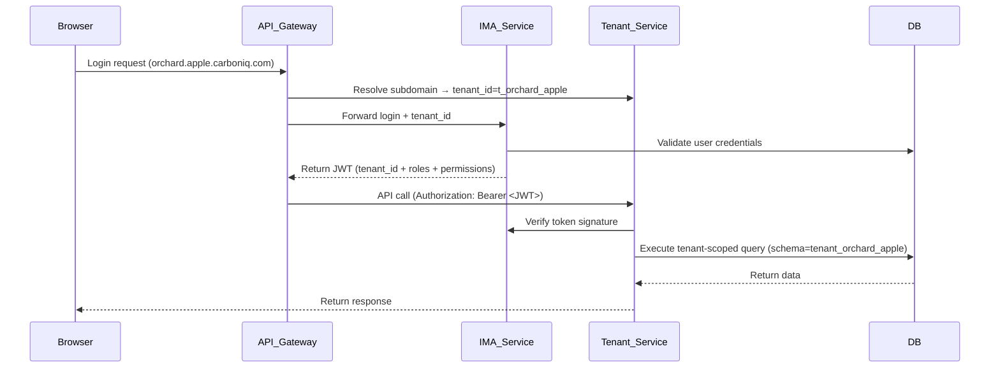

# Tenant & Sub-Tenant User Journey (IMA + Tenant Service)

---

# 🧭 User Journey: Tenant & Sub-Tenant Flow

## 🏁 1. Tenant Onboarding (via Tenant Service)

| Step | Actor | System | Description |
|------|--------|---------|--------------|
| 1.1 | Super Admin | Tenant Service | Calls `/api/v1/tenants` with `{ name: "Apple", domain: "apple.carboniq.com" }` |
| 1.2 | Tenant Service | DB | Creates `tenant_apple` schema, inserts record into `tenants` table |
| 1.3 | Tenant Service → IMA Service | API Call | Sends request to `/api/v1/auth/register` to seed a Tenant Admin user |
| 1.4 | IMA Service | DB | Creates `User(id=u_admin_apple)` and associates `tenant_id=t_apple` |
| 1.5 | IMA Service | JWT | Issues RS256-signed JWT with `sub`, `tenant_id`, `roles`, `domain` |
| 1.6 | Tenant Admin | Browser | Receives onboarding email → logs in via `apple.carboniq.com/login` |
| 1.7 | API Gateway | Domain Resolver | Detects subdomain `apple` → resolves `tenant_id=t_apple` automatically |
| 1.8 | Tenant Service | DB | Confirms tenant is active, plan type = `Enterprise` |

---

## 🌱 2. Sub-Tenant Creation (e.g., Orchard Apple)

| Step | Actor | System | Description |
|------|--------|---------|--------------|
| 2.1 | Tenant Admin (Apple) | Tenant Service | Calls `/api/v1/tenants` with payload `{ name: "Orchard Apple", parent_tenant_id: "t_apple" }` |
| 2.2 | Tenant Service | DB | Creates schema `tenant_orchard_apple` |
| 2.3 | Tenant Service | IMA Service | Registers seed users: billing, member, viewer |
| 2.4 | IMA Service | DB | Creates users and assigns roles with `tenant_id=t_orchard_apple` |
| 2.5 | IMA Service | JWT | Issues role-based tokens per user |
| 2.6 | Subdomain Routing | Gateway | Maps `orchard.apple.carboniq.com` → `tenant_id=t_orchard_apple` automatically |

---

## 🔐 3. Authentication & Tenant Resolution (IMA)

1. User logs in at `orchard.apple.carboniq.com`
2. IMA extracts subdomain = `orchard.apple`, resolves `tenant_id=t_orchard_apple`
3. Validates credentials against IMA `users` table
4. Issues Access & Refresh Token with claims:
```json
{
  "sub": "u_billing_orchard",
  "tenant_id": "t_orchard_apple",
  "roles": ["BILLING_ADMIN"],
  "permissions": ["manage_billing", "view_reports", "edit_resources", "view_resources"],
  "iss": "ima.carboniq.com"
}
```
5. Client stores JWT and uses it for subsequent requests
6. Tenant Service validates JWT and enforces RBAC based on claims

---

## ⚙️ 4. Access Control (RBAC Enforcement)

| Role | Permissions (Inherited) | Example Actions |
|------|--------------------------|-----------------|
| TENANT_ADMIN | BILLING_ADMIN + MEMBER + VIEWER | Invite/deactivate users, manage billing, CRUD all resources |
| BILLING_ADMIN | MEMBER + VIEWER | Manage invoices, view resources |
| MEMBER | VIEWER | Create & edit data, run tasks |
| VIEWER | - | Read-only dashboards, reports |

Example: `billing@orchard.apple.com` calls `/api/v1/tenants/{id}/billing` → ✅ allowed
`viewer@orchard.apple.com` calls `/api/v1/tenants/{id}/users` → ❌ forbidden

---

## 🧱 5. Data Isolation & Schema Resolution

| Context | Schema | Access Type |
|----------|---------|-------------|
| Apple Tenant | tenant_apple | Full R/W |
| Orchard Apple | tenant_orchard_apple | R/W only own schema |
| Summit Apple | tenant_summit_apple | R/W only own schema |
| Parent Tenant Access | May query sub-tenant schema (readonly) |
| Cross-Tenant Access | ❌ denied |

---

## 🔄 6. Sequence Flow Diagram



---

## 🧩 7. Key Integrations Between IMA & Tenant Service

| Function | Direction | Description |
|-----------|------------|--------------|
| Tenant → User Sync | Tenant Service → IMA Service | On tenant creation, create initial admin users in IMA |
| Auth → Tenant Resolution | IMA Service → Tenant Service | Resolve tenant_id from subdomain during login |
| Token Validation | Tenant Service → IMA Service | Verify JWT and extract roles/permissions |
| Audit Logs | Both | Record all privileged operations |

---

## 🧠 8. Example Journey Summary

| Stage | Actor | Domain | Role | Service Involved | Action |
|--------|--------|---------|------|------------------|---------|
| Tenant Creation | Super Admin | carboniq.com | SUPER_ADMIN | Tenant Service → IMA Service | Create Apple tenant, seed Tenant Admin |
| Sub-Tenant Creation | Tenant Admin (Apple) | apple.carboniq.com | TENANT_ADMIN | Tenant Service → IMA Service | Create Orchard Apple sub-tenant |
| Login | Billing Admin | orchard.apple.carboniq.com | BILLING_ADMIN | IMA Service | Login → get JWT |
| Access | Member | orchard.apple.carboniq.com | MEMBER | Tenant Service | CRUD resources (RBAC enforced) |
| View | Viewer | orchard.apple.carboniq.com | VIEWER | Tenant Service | Read-only access |

