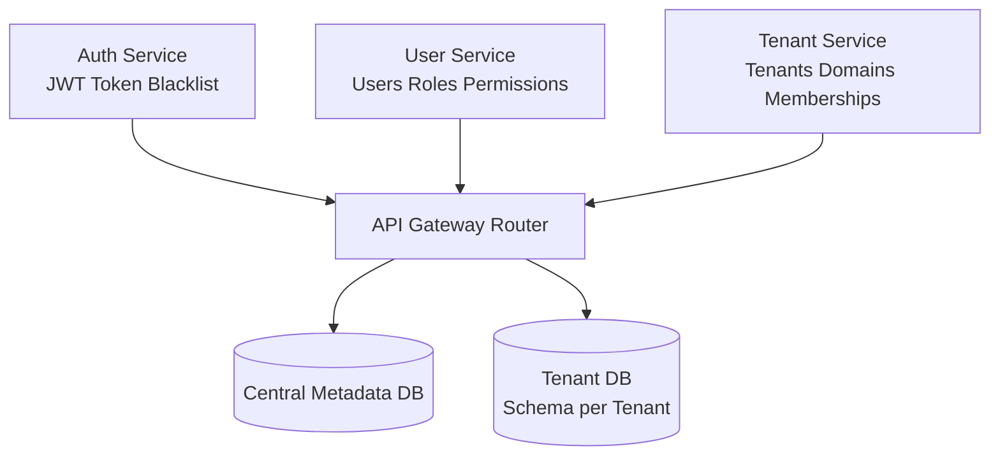
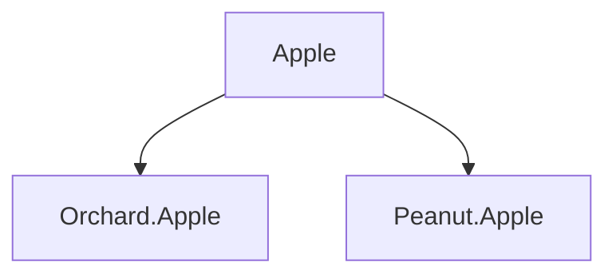
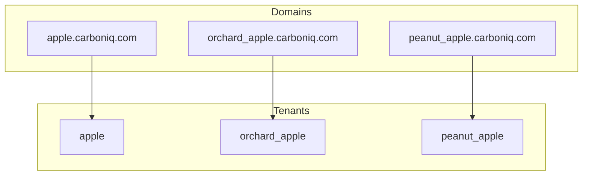
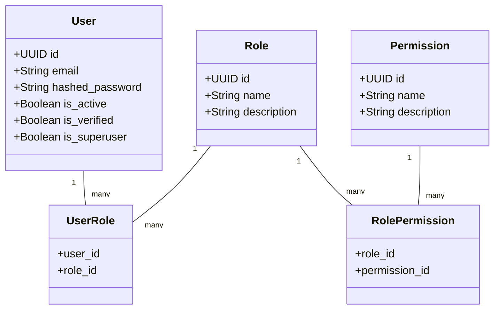
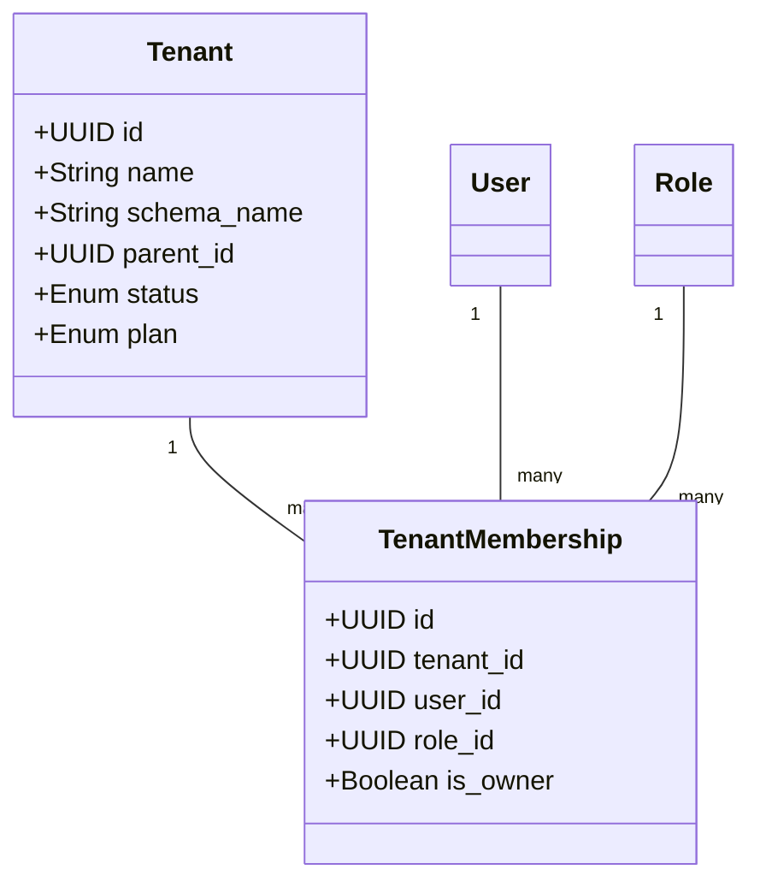
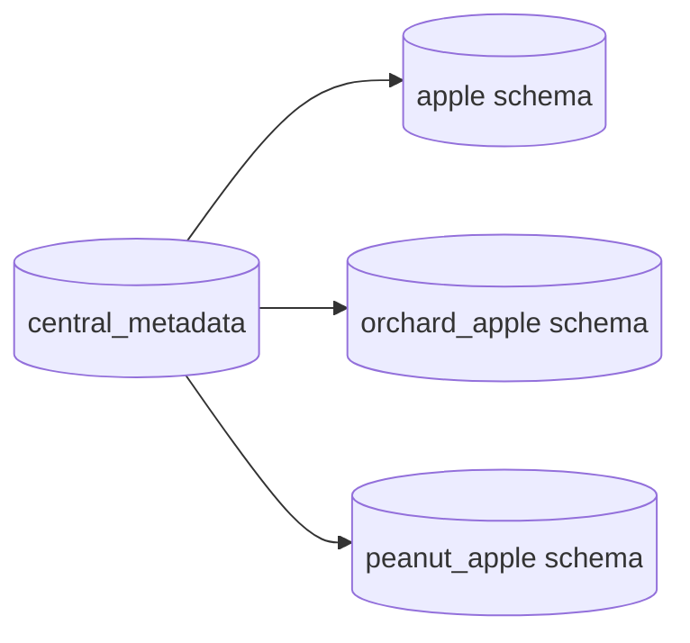

# 🧑‍💼 User Service — Multi-Tenant SaaS RBAC Documentation

The User Service acts as the central identity & authorization engine for the entire multi-tenant SaaS architecture.
It stores and manages:

- Users

- Roles

- Permissions

- User–Role (relationships)

- Role–Permission (relationships)

This service connects with the Auth Service (for JWT issuance/validation) and the Tenant Service (for tenant membership & tenant-scoped roles).

## 🚀 Features
### 🔐 Central RBAC

- Users

- Roles

- Permissions

- User ↔ Role

- Role ↔ Permission

### 🏢 Multi-Tenant Compatible

- Users exist globally

- Tenant Service assigns users → tenant → role

- Supports cross-organization access

### ⚡ High-Performance

- Cached permission lookups

- Optimized for API Gateway authorization checks

### 📁 Project Structure
```bash

user_service/
├── app/
│   ├── api/             # FastAPI routes
│   ├── crud/            # service Layer
│   ├── core/            # Config, exceptions, security
│   ├── models/          # SQLAlchemy models (User, Role, Permission, etc.)
│   ├── repositories/    # CRUD repository layer
│   ├── schemas/         # Pydantic schemas
│   └── services/        # Business logic (RBAC, user mgmt)
├── tests/
├── Dockerfile
└── pyproject.toml

```

### 🧩 API Responsibilities
- User APIs

- Create user

- Update user details

- Activate/deactivate

- Change password

- Role APIs

- Create/delete role

- Assign/remove role from user

- Permission APIs

- List/create permissions

- Attach/detach permissions to roles

- Internal APIs (Used by Auth & Gateway)

- /verify → Return user roles & permissions

Key Concepts

✔ Central users (login once, access many tenants)
✔ Global roles + permissions
✔ Each tenant uses TenantMembership(role_id) to link User → Tenant → Role
✔ Cached properties for fast permission lookup

2. Data Models

    2.1 User

    | Field           | Type    | Description               |
    | --------------- | ------- | ------------------------- |
    | id              | UUID    | Primary key               |
    | email           | String  | Unique login email        |
    | hashed_password | String  | bcrypt-hashed password    |
    | full_name       | String  | Optional name             |
    | is_active       | Boolean | User enabled/disabled     |
    | is_verified     | Boolean | Email verification status |
    | is_superuser    | Boolean | Global platform admin     |

    2.2 Role

    Represents a named RBAC role, e.g.:

    - TANENT_ADMIN

    - TANENT_BILLING

    - MEMBER

    - VIEWER


    | Field       | Type   | Description          |
    | ----------- | ------ | -------------------- |
    | id          | UUID   | Primary key          |
    | name        | String | Unique role name     |
    | description | Text   | Optional description |


    2.3 Permission

    Represents an atomic capability, e.g.:

    - document:create

    - user:invite

    - billing:read

    | Field       | Type   | Description           |
    | ----------- | ------ | --------------------- |
    | id          | UUID   | Primary key           |
    | name        | String | Unique permission key |
    | description | Text   | Optional details      |


    2.4 UserRole (Association Table)

    - Maps Users → Roles (global roles, not tenant-scoped).

    | Field   | Type | Description |
    | ------- | ---- | ----------- |
    | user_id | UUID | FK to User  |
    | role_id | UUID | FK to Role  |

    2.5 RolePermission (Association Table)

    - Maps Roles → Permissions.

    | Field         | Type | Description      |
    | ------------- | ---- | ---------------- |
    | role_id       | UUID | FK to Role       |
    | permission_id | UUID | FK to Permission |


    3. RBAC Logic

    3.1 Role Inheritance (Global)

    - User permissions are derived from:
    ```sql
    User → Roles → Permissions
    ```

    3.2 Permission Caching

    - The model provides cached properties:
    ```py
    user.roles_cached
    user.permissions_cached
    ```
    Used by:

        1. Auth Service when generating JWT

        2. Tenant Service when validating membership role

        3. API gateway for request-based authorization

    4. Integration With Tenant Service

    -  The User Service does NOT store tenant-specific roles or membership.

    Tenant Service stores:

       1. TenantMembership(user_id, role_id)

       2. TenantDomain

        3. Parent/child tenant structure

     So the flow becomes:
     ```sql
     User Service  →  Global RBAC
    Tenant Service →  Tenant mapping + Tenant roles
    Auth Service  →  Token issuance
    ```

    Example Multi-Tenant Scenario

        User: john@example.com
        John is:

        Owner of Apple

        Viewer of orchard.apple

        No access to tech.orrange
    | Tenant        | Role (TenantMembership) |
    | ------------- | ----------------------- |
    | Apple         | owner                   |
    | orchard.apple | viewer                  |
    | tech.orrange  | — (no membership)       |


    5. API Responsibilities

    5.1 User Endpoints

        Create user

        Update profile

        Activate/deactivate user

        Verify email

        Change password

    5.2 Role Endpoints

        Create role

        Assign/remove roles to users

        List roles

        Attach permissions to roles

    5.3 Permission Endpoints

        List permissions

        Create permissions

    5.4 Internal Endpoints (Consumed by Auth Service)

        GET /verify


    6. Example Data

    USERS

    | email                                           | roles  | active |
    | ----------------------------------------------- | ------ | ------ |
    | [admin@apple.com](mailto:admin@apple.com)       | admin  | True   |
    | [alice@apple.com](mailto:alice@apple.com)       | member | True   |
    | [viewer@orchard.com](mailto:viewer@orchard.com) | viewer | True   |

    ROLES

    | name   | description        |
    | ------ | ------------------ |
    | owner  | Full tenant access |
    | admin  | Manage users/docs  |
    | member | Basic contributor  |
    | viewer | Read-only          |

    Permissions

    | name            |
| --------------- |
| user.invite     |
| user.read       |
| document.create |
| document.update |
| billing.read    |


## 🚀 Multi-Tenant SaaS Architecture
1. High-Level System Architecture



2. Tenant Hierarchy



3. Domain & Schema Mapping


4. User–Role–Permission (RBAC)



5. Tenant Membership + User Linking



6. Schema-per-Tenant Structure



## 🐳  Dockarize

1.  contanirize
- a. Build (Linux/AWS ready)
```bash
docker build --platform linux/amd64 \
  -t diptu/user_service:V0.0.1 \
  -f user_service/Dockerfile .

```
- b. Build (Local Mac ready)

```bash
docker build -t user_service  \
    -f user_service/Dockerfile .

```
2. Run Dockarize containner
```bash
 docker run -p 8000:8000 --env-file user_service/app/.env user_service
```

## push to hub

1. update tag with version

```bash
docker tag user_service:latest diptu/user_service:version0.0.1 # here user_service is the hub reponame
```
2.
a. login to docker hub

```bash
docker login
```
push image to hub

```bash
 docker push diptu/user_service:version0.0.1
```


## Host to AWS EC2

[Host to Aws](https://www.youtube.com/watch?v=X0lnToYN21k&list=PLKnIA16_RmvZ41tjbKB2ZnwchfniNsMuQ&index=12)
 1. create an EC2 instance
 2. Connect to the EC2 instance

 3. Run the following commands
  a. sudo apt-get update
  b. sudo apt-get install -y docker.io
  c. sudo systemctl start docker
  d. sudo systemctl enable docker
  e. sudo usermod -aG docker $USER
  f. exit

 4. Restart a new connection to EC2 instance
 5. Run the following commands
  a. docker pull diptu/user_service:V0.0.1
  b. docker run -p 8000:8000 diptu/user_service:V0.0.1

 6. change security group settings
 7. Check the API
 8. Change the frontend code

# [Link to access](http://3.25.65.83:8000/)
