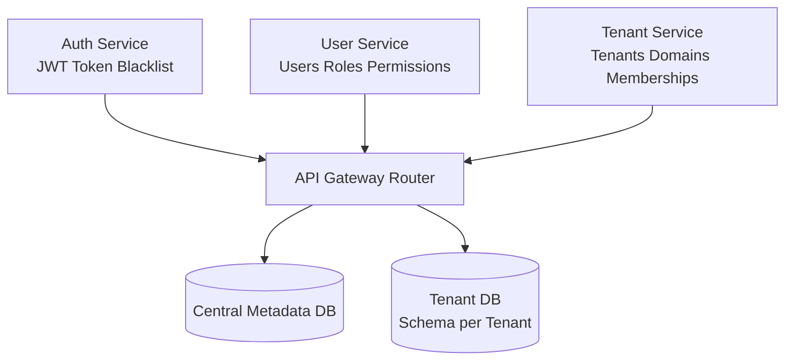
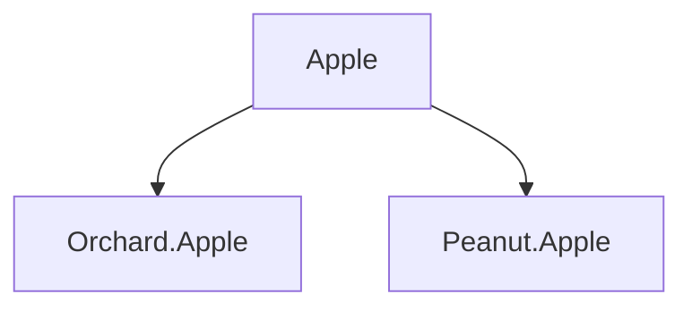
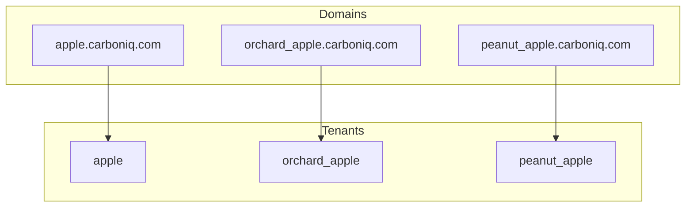
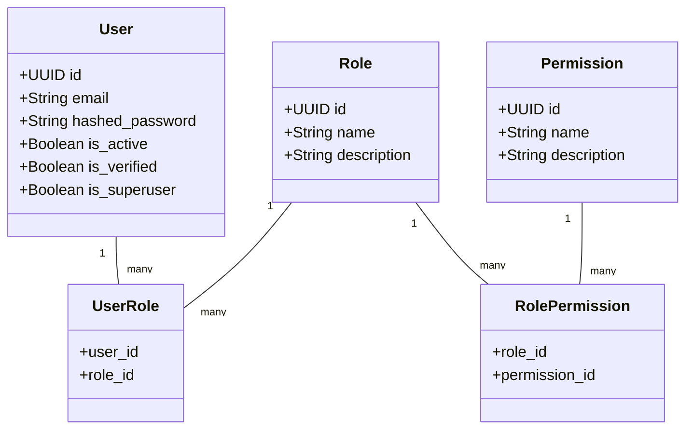
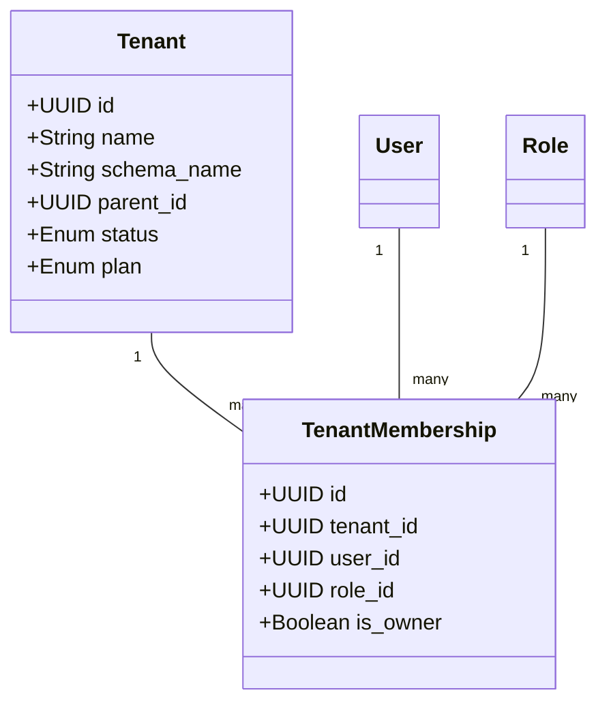
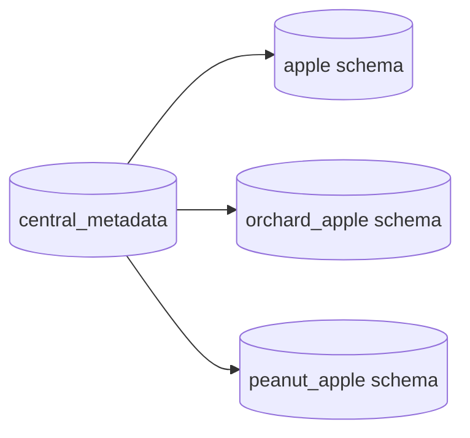

# 🧑‍💼 User Service — Multi-Tenant SaaS RBAC Documentation

The User Service acts as the central identity & authorization engine for the entire multi-tenant SaaS architecture.
It stores and manages:

- Users

- Roles

- Permissions

- User–Role (relationships)

- Role–Permission (relationships)

This service connects with the Auth Service (for JWT issuance/validation) and the Tenant Service (for tenant membership & tenant-scoped roles).


1. Overview

The User Service provides a centralized RBAC system for all tenants in the platform.

Responsibilitie
| Component          | Responsibility                                                 |
| ------------------ | -------------------------------------------------------------- |
| **User Service**   | Stores global user accounts and global RBAC mapping            |
| **Auth Service**   | Issues, verifies, and blacklists JWT tokens                    |
| **Tenant Service** | Uses user IDs and role IDs to assign users to specific tenants |


Key Concepts

✔ Central users (login once, access many tenants)
✔ Global roles + permissions
✔ Each tenant uses TenantMembership(role_id) to link User → Tenant → Role
✔ Cached properties for fast permission lookup

2. Data Models

    2.1 User

    | Field           | Type    | Description               |
    | --------------- | ------- | ------------------------- |
    | id              | UUID    | Primary key               |
    | email           | String  | Unique login email        |
    | hashed_password | String  | bcrypt-hashed password    |
    | full_name       | String  | Optional name             |
    | is_active       | Boolean | User enabled/disabled     |
    | is_verified     | Boolean | Email verification status |
    | is_superuser    | Boolean | Global platform admin     |

    2.2 Role

    Represents a named RBAC role, e.g.:

    - TANENT_ADMIN

    - TANENT_BILLING

    - MEMBER

    - VIEWER


    | Field       | Type   | Description          |
    | ----------- | ------ | -------------------- |
    | id          | UUID   | Primary key          |
    | name        | String | Unique role name     |
    | description | Text   | Optional description |


    2.3 Permission

    Represents an atomic capability, e.g.:

    - document:create

    - user:invite

    - billing:read

    | Field       | Type   | Description           |
    | ----------- | ------ | --------------------- |
    | id          | UUID   | Primary key           |
    | name        | String | Unique permission key |
    | description | Text   | Optional details      |


    2.4 UserRole (Association Table)

    - Maps Users → Roles (global roles, not tenant-scoped).

    | Field   | Type | Description |
    | ------- | ---- | ----------- |
    | user_id | UUID | FK to User  |
    | role_id | UUID | FK to Role  |

    2.5 RolePermission (Association Table)

    - Maps Roles → Permissions.

    | Field         | Type | Description      |
    | ------------- | ---- | ---------------- |
    | role_id       | UUID | FK to Role       |
    | permission_id | UUID | FK to Permission |


    3. RBAC Logic

    3.1 Role Inheritance (Global)

    - User permissions are derived from:
    ```sql
    User → Roles → Permissions
    ```

    3.2 Permission Caching

    - The model provides cached properties:
    ```py
    user.roles_cached
    user.permissions_cached
    ```
    Used by:

        1. Auth Service when generating JWT

        2. Tenant Service when validating membership role

        3. API gateway for request-based authorization

    4. Integration With Tenant Service

    -  The User Service does NOT store tenant-specific roles or membership.

    Tenant Service stores:

       1. TenantMembership(user_id, role_id)

       2. TenantDomain

        3. Parent/child tenant structure

     So the flow becomes:
     ```sql
     User Service  →  Global RBAC
    Tenant Service →  Tenant mapping + Tenant roles
    Auth Service  →  Token issuance
    ```

    Example Multi-Tenant Scenario

        User: john@example.com
        John is:

        Owner of Apple

        Viewer of orchard.apple

        No access to tech.orrange
    | Tenant        | Role (TenantMembership) |
    | ------------- | ----------------------- |
    | Apple         | owner                   |
    | orchard.apple | viewer                  |
    | tech.orrange  | — (no membership)       |


    5. API Responsibilities

    5.1 User Endpoints

        Create user

        Update profile

        Activate/deactivate user

        Verify email

        Change password

    5.2 Role Endpoints

        Create role

        Assign/remove roles to users

        List roles

        Attach permissions to roles

    5.3 Permission Endpoints

        List permissions

        Create permissions

    5.4 Internal Endpoints (Consumed by Auth Service)

        GET /verify


    6. Example Data

    USERS

    | email                                           | roles  | active |
    | ----------------------------------------------- | ------ | ------ |
    | [admin@apple.com](mailto:admin@apple.com)       | admin  | True   |
    | [alice@apple.com](mailto:alice@apple.com)       | member | True   |
    | [viewer@orchard.com](mailto:viewer@orchard.com) | viewer | True   |

    ROLES

    | name   | description        |
    | ------ | ------------------ |
    | owner  | Full tenant access |
    | admin  | Manage users/docs  |
    | member | Basic contributor  |
    | viewer | Read-only          |

    Permissions

    | name            |
| --------------- |
| user.invite     |
| user.read       |
| document.create |
| document.update |
| billing.read    |


## 🚀 Multi-Tenant SaaS Architecture
1. High-Level System Architecture



2. Tenant Hierarchy



3. Domain & Schema Mapping


4. User–Role–Permission (RBAC)



5. Tenant Membership + User Linking



6. Schema-per-Tenant Structure




## User Service models:

| Model              | Table Name         | Key Fields                                                                          | Relationships                                                        | Notes                                                                                              |
| ------------------ | ------------------ | ----------------------------------------------------------------------------------- | -------------------------------------------------------------------- | -------------------------------------------------------------------------------------------------- |
| **BaseModel**      | (abstract)         | `id: UUID`, `created_at`, `updated_at`, `created_by`, `updated_by`                  | N/A                                                                  | Abstract base with timestamps & audit; inherited by all models                                     |
| **User**           | `users`            | `email`, `hashed_password`, `full_name`, `is_active`, `is_verified`, `is_superuser` | `roles: UserRole`                                                    | Cached properties: `roles_cached`, `permissions_cached`; user-to-role many-to-many via `UserRole`  |
| **Role**           | `roles`            | `name`, `description`                                                               | `users: UserRole`, `permissions: Permission via RolePermission`      | Role-to-user many-to-many via `UserRole`; Role-to-permission via `RolePermission`                  |
| **Permission**     | `permissions`      | `name`, `description`                                                               | `role_permissions: RolePermission`, `roles: Role via RolePermission` | Permission-to-role many-to-many via `RolePermission`                                               |
| **UserRole**       | `user_roles`       | `user_id`, `role_id`                                                                | `user: User`, `role: Role`                                           | Association table between `User` and `Role`; unique constraint on `(user_id, role_id)`             |
| **RolePermission** | `role_permissions` | `role_id`, `permission_id`                                                          | `role: Role`, `permission: Permission`                               | Association table between `Role` and `Permission`; unique constraint on `(role_id, permission_id)` |


## CRUD Summary Table

| CRUD Class             | Model               | Key Methods                                                                                                                                          | Notes / Special Logic                                                                                              |
| ---------------------- | ------------------- | ---------------------------------------------------------------------------------------------------------------------------------------------------- | ------------------------------------------------------------------------------------------------------------------ |
| **BaseCRUD**           | Generic (any model) | `get`, `get_all`, `create`, `update`, `delete`, `count`                                                                                              | Generic, reusable, uses Pydantic schemas; no tenant awareness; synchronous; basic commit/refresh                   |
| **PermissionCRUD**     | `Permission`        | `get`, `get_by_name`, `get_all`, `create`, `update`, `delete`, `count`                                                                               | Custom `get_by_name`; otherwise similar to BaseCRUD; lacks tenant filtering                                        |
| **RoleCRUD**           | `Role`              | `get`, `get_by_name`, `get_all`, `create`, `update`, `delete`, `count`                                                                               | Similar to PermissionCRUD; ensures unique role names; lacks tenant filtering                                       |
| **RolePermissionCRUD** | `RolePermission`    | `get`, `get_by_role_permission`, `get_all`, `create`, `delete`, `count`                                                                              | Prevents duplicate assignment (`get_by_role_permission` check before create)                                       |
| **UserRoleCRUD**       | `UserRole`          | `get`, `get_by_user_role`, `get_all`, `create`, `delete`, `count`                                                                                    | Prevents duplicate assignment (`get_by_user_role`)                                                                 |
| **UserCRUD**           | `User`              | `get`, `get_by_email`, `get_all`, `create`, `update`, `delete`, `verify_password`, `get_permissions`, `get_roles`, `activate`, `deactivate`, `count` | Hashes passwords on create; permission & role helpers; activate/deactivate methods; no tenant filtering in queries |


## CRUD Improvement Checklist
- Generalization / Reduce Duplication

    - Inherit BaseCRUD for Permission, Role, RolePermission, UserRole, User where possible.

    - Only implement model-specific methods (get_by_name, get_by_user_role) in derived classes.

Move Business Logic to Service Layer

- CRUD should only handle DB operations.

    - Hashing passwords, activating/deactivating users, computing permissions/roles should live in a service layer, which calls CRUD as needed.


- Async Support

    - Consider using async SQLAlchemy (async session + await) if API will have high concurrency.

- Batch / Bulk Operations

    - For Role/User assignments, allow batch create/delete to reduce DB roundtrips.

    - Use bulk_save_objects or INSERT ... ON CONFLICT for PostgreSQL.

- Consistency in Method Names

    - Some methods are get_by_user_role, get_by_role_permission; others get_by_email. Standardize naming (e.g., get_by_<unique_field>).

- Return Types

    - Ensure all CRUD methods consistently return None if object not found or raise a standard exception.

    - Avoid returning existing in create silently; consider raising AlreadyExistsError.

- Exception Handling

    - Wrap commits in try/except for IntegrityError (e.g., unique constraint violations).

    - Optionally provide standard error responses (or raise service-layer exceptions).

- Caching

    - Frequently accessed objects (user roles/permissions) could be cached for short TTL to improve performance.

- Logging / Observability

    - Log CRUD operations in multi-tenant context (e.g., tenant_id, user_id, operation).

- Schema Separation

    - Keep CRUD strictly DB-focused: map CreateSchemaType / UpdateSchemaType to models in CRUD.

    - Avoid returning Pydantic schemas from CRUD; leave that to the service layer or API layer.

- Testing

    - Unit tests for CRUD methods should verify:

    - Correct tenant scoping

    - Duplicate prevention (get_by_* checks)

    - Correct behavior on create/update/delete

    - Permissions/roles fetched correctly from relationships

## API Layer Improvement checklist:

| **Aspect**                      | **Current Implementation**                                                             | **Observations / Issues**                                                                                                                        | **Suggestions / Improvements**                                                                                                                                                      |
| ------------------------------- | -------------------------------------------------------------------------------------- | ------------------------------------------------------------------------------------------------------------------------------------------------ | ----------------------------------------------------------------------------------------------------------------------------------------------------------------------------------- |
| **Request Timer**               | Decorator `request_timer` repeated in every module.                                    | Logic is mostly duplicated. In some modules it handles `dict`, in others only `APIResponse`.                                                     | Move `request_timer` to a **shared util module** and handle both `dict` and `APIResponse` consistently. Reduce code duplication.                                                    |
| **Error Handling**              | Uses `HTTPException` directly for not found, duplicate, invalid IDs.                   | Works fine but sometimes repeated UUID parsing and 404 checks across modules.                                                                    | Create **shared fetch helper** with automatic 404 handling for UUIDs (you started doing this). Could be centralized for `User`, `Role`, `Permission`, `RolePermission`, `UserRole`. |
| **CRUD Fetching**               | `fetch_*_or_404` exists for most entities, but naming and return type is inconsistent. | Some return ORM object, some return dict payload.                                                                                                | Standardize `fetch_*_or_404` to always return **ORM object**, let response building be separate.                                                                                    |
| **Pagination**                  | Manual calculation of `previousPage` and `nextPage`.                                   | Works but inconsistent across modules (sometimes uses `skip`, sometimes uses `current_page`).                                                    | Create **shared pagination helper** to standardize calculation and return `{count, perPage, previousPage, nextPage}`.                                                               |
| **Response Formatting**         | Uses `build_api_response` in all routes.                                               | Very good consistency. But sometimes `include_user_context` is True, sometimes False.                                                            | Consider **default False** for assignments (`RolePermission`, `UserRole`) and True only when needed. Centralize common `meta_extra` fields like `"source"`.                         |
| **UUID Handling**               | User routes parse UUID from string manually.                                           | Slight redundancy.                                                                                                                               | Use **Pydantic path parameter type `UUID`** directly in FastAPI. FastAPI auto-validates and rejects invalid UUIDs.                                                                  |
| **Permissions Checking**        | Uses `Depends(require_permissions([...]))` consistently.                               | ✅ Good adherence to RBAC.                                                                                                                        | Could create **wrapper decorator** to reduce repetition for CRUD endpoints: e.g., `@permission_required("permission.create")`.                                                      |
| **Create vs Update**            | Checks for duplicates before create. Update doesn’t check for conflicts.               | May allow duplicate names on update.                                                                                                             | Add optional **duplicate name check** for update operations.                                                                                                                        |
| **Response Models**             | Mostly `APIResponse`, sometimes returning dicts with `model_dump()`.                   | Slight inconsistency; sometimes decorator `response_model=APIResponse` matches dict output, sometimes ORM output converted via `model_validate`. | Standardize all endpoints to return **APIResponse with validated Pydantic model**. Remove `.model_dump()` unless absolutely necessary.                                              |
| **Role/Permission Assignments** | `RolePermission` and `UserRole` return dicts instead of schema models.                 | Breaks consistency with other endpoints (`PermissionOut`, `RoleOut`).                                                                            | Define **Pydantic schema** for `RolePermissionRead` and `UserRoleRead` (you did partially), and always use `.model_validate()`.                                                     |
| **Security / OpenAPI**          | `openapi_extra` used consistently.                                                     | ✅ Good practice.                                                                                                                                 | Could extract a **shared router decorator** to auto-add `BearerAuth` security to all routers.                                                                                       |
| **Reusability**                 | Lots of repeated patterns (create, get, list, update, delete).                         | Could be abstracted into **generic CRUD base route generator**.                                                                                  | Create **generic CRUD router factory** that takes `CRUD` class, schema, and permissions. Reduces boilerplate 80–90%.                                                                |
| **Miscellaneous**               | Some `print()` statements (`verify_user`) remain.                                      | Debug prints in production code.                                                                                                                 | Remove debug prints; consider **structured logging**.                                                                                                                               |
| **Password Handling**           | `verify_user` uses `pwd_context.verify` directly.                                      | Works, but could be abstracted.                                                                                                                  | Consider moving **authentication logic** to service layer instead of API for cleaner separation.                                                                                    |

## Core Layer improvement checklist:

| **Module / Function**            | **Observations**                                                                                  | **Potential Issues**                                                                                                                                                                                                                               | **Suggested Improvements**                                                                                                                                                                                                                                        |
| -------------------------------- | ------------------------------------------------------------------------------------------------- | -------------------------------------------------------------------------------------------------------------------------------------------------------------------------------------------------------------------------------------------------- | ----------------------------------------------------------------------------------------------------------------------------------------------------------------------------------------------------------------------------------------------------------------- |
| `Settings` (config.py)           | Uses `BaseSettings` from Pydantic v2, `.env` support, defaults for app name, debug, database URLs | 1. Some required fields like `SECRET_KEY` are commented out → risk of runtime failure.<br>2. Type mismatch risk: `BASE_DIR / FILE_PATH` pattern might fail if `FILE_PATH` is None.<br>3. Environment-specific settings not fully validated.        | 1. Uncomment and enforce required sensitive fields (`SECRET_KEY`, `ALGORITHM`).<br>2. Use Pydantic `Field(..., env="VAR_NAME")` for required fields.<br>3. Consider using `validator` or `__post_init__` for additional runtime validation.                       |
| `create_access_token`            | Generates JWT with roles, permissions, tenant_id, supports return of payload                      | 1. Directly uses `settings.SECRET_KEY` without null check → could raise `TypeError` if unset.<br>2. Uses naive datetime UTC; might need timezone-aware tokens.<br>3. Repeated `datetime.utcnow()` calls for `exp` and `iat` could differ slightly. | 1. Add a check to raise clear exception if `SECRET_KEY` is None.<br>2. Use `datetime.now(tz=timezone.utc)` for consistent timestamps.<br>3. Consolidate `now = datetime.utcnow()` and use `now` for both `exp` and `iat`.                                         |
| `create_refresh_token`           | Similar to access token, but for refresh                                                          | 1. Same issues as access token.<br>2. Minimal claims; consider including token version or client info to improve security.                                                                                                                         | 1. Align timestamp handling with access token.<br>2. Optionally add `token_version` or device info to payload for refresh token revocation.                                                                                                                       |
| `decode_token`                   | Decodes JWT and handles exceptions                                                                | 1. Prints decoded payload and errors → could leak sensitive info in production logs.<br>2. No validation for `sub` or `type` claim → could accept malformed tokens.                                                                                | 1. Replace `print` statements with structured logging at `DEBUG` level.<br>2. Add payload claim validation (e.g., `type` must be `"access"` for access tokens).<br>3. Wrap in helper to catch and convert `JWTError` to standardized API error.                   |
| `APIResponse` / `build_response` | Well-structured standard API response model; includes trace/correlation IDs, RBAC info, meta      | 1. `data` field is `Any` → loses type safety.<br>2. Repeated manual construction of response in multiple endpoints.<br>3. No automated `request_duration_ms` integration; depends on decorators in API layer.                                      | 1. Consider using generic typing: `APIResponse[T]` for type-safe `data`.<br>2. Add optional helper to inject `request_duration_ms` automatically.<br>3. Optionally provide helper to include `user_id`, `roles`, `permissions` from `current_user` automatically. |
| `build_response_from_request`    | Auto-reads trace/correlation IDs from request headers                                             | 1. If headers are missing, creates new UUID → good, but not consistent across microservices unless propagated.<br>2. No way to attach `request_duration_ms` automatically.                                                                         | 1. Propagate trace IDs in middleware for consistency.<br>2. Combine with `request_timer` decorator for automatic duration tracking.                                                                                                                               |
| General core layer patterns      | Good separation: config, JWT utils, API response helpers                                          | 1. Repetition risk: `request_timer` decorator exists in API layer and duplicates `meta` injection logic.<br>2. JWT and APIResponse tightly coupled to `settings` → hard to test.                                                                   | 1. Consider a shared `core/utils.py` for decorators, logging, JWT, response builders.<br>2. Inject `settings` or `secret_key` as dependency to improve testability.<br>3. Add type hints for JWT payload structures.                                              |

## Schemas layer with improvement suggestions

| **Schema / Module**                                                       | **Observations**                                                                                                                             | **Potential Issues / Limitations**                                                                                                                                                                                                                                                        | **Suggested Improvements**                                                                                                                                                                                                                |
| ------------------------------------------------------------------------- | -------------------------------------------------------------------------------------------------------------------------------------------- | ----------------------------------------------------------------------------------------------------------------------------------------------------------------------------------------------------------------------------------------------------------------------------------------- | ----------------------------------------------------------------------------------------------------------------------------------------------------------------------------------------------------------------------------------------- |
| `PermissionBase`, `PermissionCreate`, `PermissionUpdate`, `PermissionOut` | Clear separation of base, create, update, and response schemas; uses `Field` for descriptions/examples; `PermissionOut` enables ORM parsing. | 1. `PermissionUpdate` repeats fields instead of inheriting from `PermissionBase` with optional fields.<br>2. `json_schema_extra` used inconsistently across schemas.<br>3. No validation for unique names or restricted patterns.                                                         | 1. Use `PermissionBase` with `Optional` for update: `class PermissionUpdate(PermissionBase): ...`<br>2. Standardize `json_schema_extra` formatting.<br>3. Add validators for name format/length if needed.                                |
| `RoleBase`, `RoleCreate`, `RoleUpdate`, `RoleOut`                         | Similar structure to permissions; clean and consistent; ORM parsing enabled for `RoleOut`.                                                   | 1. `RoleUpdate` repeats fields instead of optional inheritance.<br>2. No enum support for predefined roles (if applicable).                                                                                                                                                               | 1. Use optional inheritance: `class RoleUpdate(RoleBase): name: Optional[str]; ...`.<br>2. Consider `Literal` or `Enum` for role names if certain roles are fixed.                                                                        |
| `UserBase`, `UserCreate`, `UserUpdate`, `UserOut`                         | Uses `EmailStr` for email validation, password min_length enforced in create schema, boolean flags included.                                 | 1. `UserUpdate` does not inherit from `UserBase`, resulting in duplicated definitions.<br>2. No password field in `UserOut` (good), but no validator for strong password rules beyond min_length.<br>3. `full_name` and other optional fields could benefit from stripping/normalization. | 1. Use inheritance: `class UserUpdate(UserBase): ...` with all optional.<br>2. Add password strength validator (uppercase, digits, symbols) in create schema.<br>3. Normalize/strip string fields (`full_name`) via `validator`.          |
| `UserRoleBase`, `UserRoleCreate`, `UserRoleRead`                          | Clean base + create + read structure; UUID used for relationships; ORM parsing enabled.                                                      | 1. No validation for existing user/role IDs at schema level (can only be done at service/db layer).<br>2. `UserRoleRead` only adds ID; might consider adding timestamps if useful.                                                                                                        | 1. Optional: include `created_at`/`updated_at` in `UserRoleRead`.<br>2. Add validators for UUID format consistency if needed.                                                                                                             |
| `RolePermissionBase`, `RolePermissionCreate`, `RolePermissionRead`        | Same pattern as UserRole; clean and consistent.                                                                                              | 1. Same as UserRole: no timestamps or existence validation.<br>2. `RolePermissionRead` adds only ID; may benefit from audit info.                                                                                                                                                         | 1. Add optional `created_at`/`updated_at` fields to `RolePermissionRead`.<br>2. Consider combining UserRole and RolePermission patterns into generic "relation" schema base for DRYness.                                                  |
| General Schema Patterns                                                   | Strong use of Pydantic, field metadata, clear separation for CRUD operations, ORM parsing enabled where needed.                              | 1. Repetition in Update schemas (not inheriting from Base schemas with optional fields).<br>2. `json_schema_extra` sometimes inconsistent.<br>3. No generic type-safe response wrapper for lists vs single object.                                                                        | 1. Refactor Update schemas to inherit from Base schemas with all fields optional.<br>2. Standardize `json_schema_extra` usage.<br>3. Optionally add `Response[T]` generic schema for API responses containing lists or paginated results. |
| Type Hints & Validation                                                   | Good use of `UUID`, `EmailStr`, `datetime`                                                                                                   | 1. No Pydantic validators for enforcing string constraints (e.g., trimming, case normalization).<br>2. No cross-field validation (e.g., a role must have at least one permission in creation).                                                                                            | 1. Add `@validator` for normalization (trim, lowercase).<br>2. Consider `root_validator` for cross-field checks when needed.                                                                                                              |
